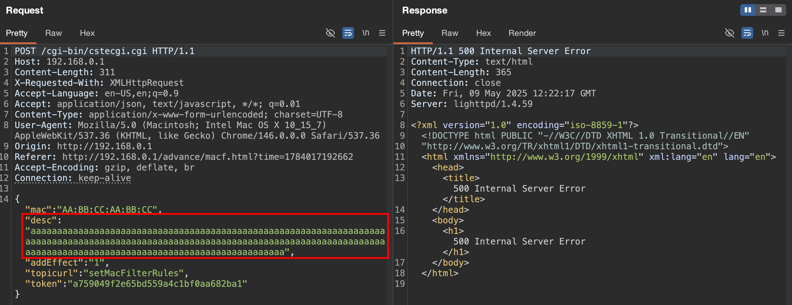
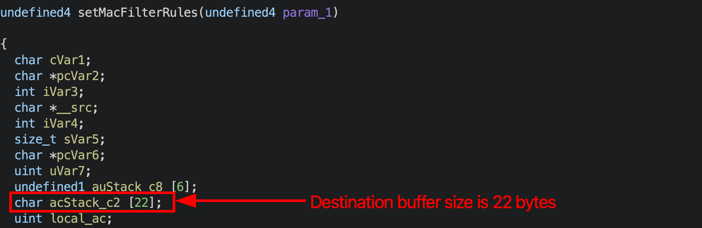
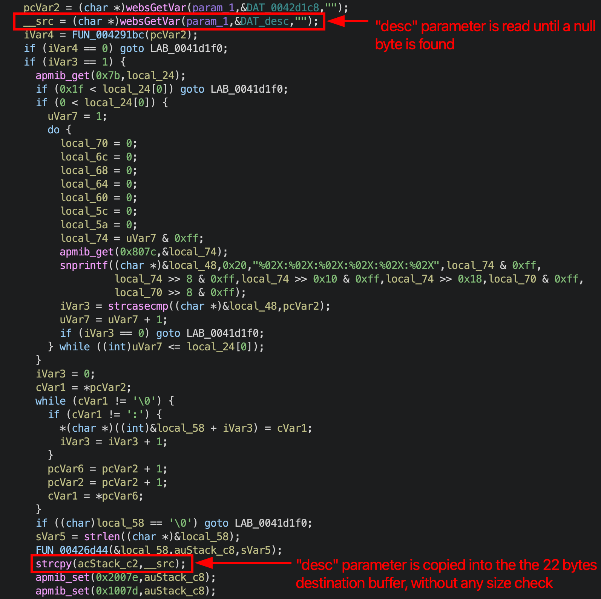
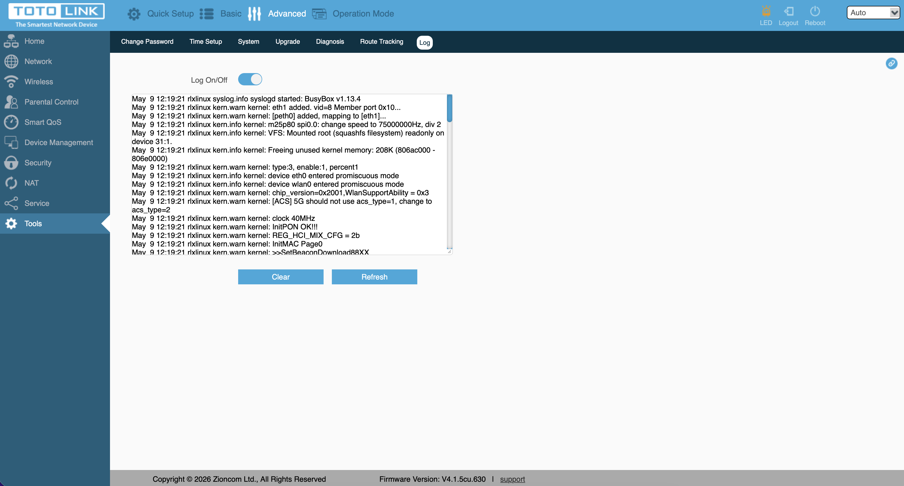
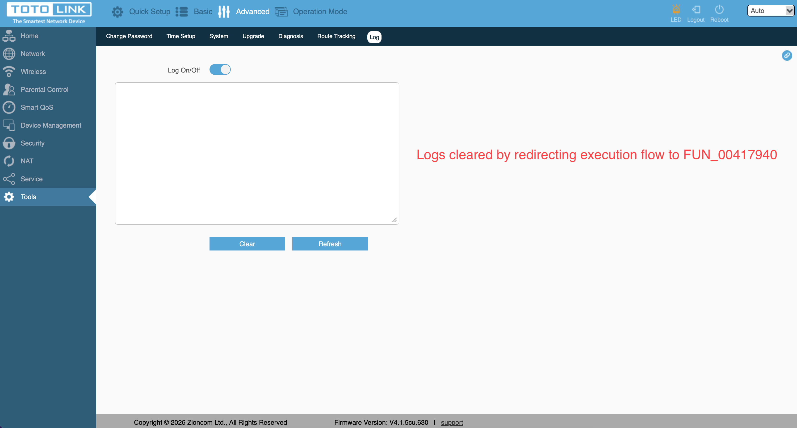
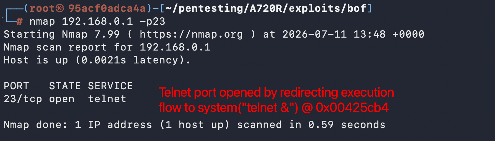

# A720R Buffer Overflow

## Submitter: Nicola Giuffrida

## Information

**Vendor:** TOTOLINK  
**Vendor's website:** [TOTOLINK](https://www.totolink.net/)  
**Model:** A720R  
**Firmware version:** V4.1.5cu.630_B20250509  
**Firmware download address:** [TOTOLINK](https://www.totolink.net/home/menu/detail/menu_listtpl/download/id/203/ids/36.html)

## Severity

CVSS v4.0 Base Score: 8.7 (High)  
Vector: `CVSS:4.0/AV:N/AC:L/AT:N/PR:H/UI:N/VC:H/VI:H/VA:H/SC:N/SI:N/SA:N`

## Vulnerability details

A stack-based buffer overflow exists in the `cstecgi.cgi` firmware binary that allows an authenticated administrator to hijack the control flow of the process and execute existing code paths within the binary. The vulnerability can be triggered by sending a crafted request to the `setMacFilterRules` handler containing an overly long value of a `desc` parameter, which is copied into a fixed-size stack buffer via `strcpy()` without any bounds checking, overwriting the saved return address.

The vulnerable code is located within the `cstecgi.cgi` binary, where the supplied value of `desc` is copied into a stack buffer without length validation, allowing the saved return address to be overwritten and the program's control flow to be redirected. As the binary is compiled without stack canaries and without PIE, the overflow goes undetected and execution can be reliably redirected to code residing at fixed addresses within the binary.

By overwriting the saved return address, control flow was redirected to existing functions within the binary. This was demonstrated by invoking a `sleep(2)` call (confirming reliable control of the instruction pointer through a measurable delay in the device's response), the system reboot routine, the session logout function, and the log-clearing routine.

Control flow was further redirected to the routine responsible for starting the Telnet service, enabling Telnet on the device.

As a result, an authenticated attacker with network access to the target device can hijack the execution flow of the `cstecgi.cgi` process and execute arbitrary code paths within the binary, compromising the confidentiality, integrity, and availability of the device.
